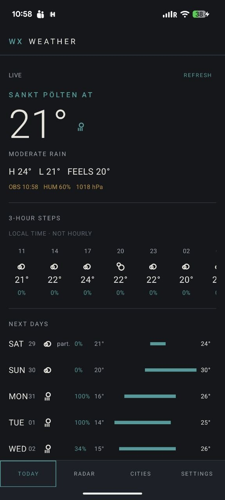

# Wx Weather

**A native Android weather app with zero tracking.**

Current conditions, forecasts, saved cities, offline-friendly caching, and a map instrument. No accounts, no analytics, no background location, no cloud sync.

<div align="center">
  
</div>

<p align="center"><em>Today view. The capture includes the phone status bar.</em></p>

**[Product page & screenshots → radilabs.com/wx-weather](https://www.radilabs.com/wx-weather/)**

## What it does

- Current conditions with high / low, feels-like, humidity, pressure, wind and direction, precipitation, visibility, and air quality where the data is available
- 3-hour forecast steps for the next 24 hours (labelled `LOCAL TIME · NOT HOURLY` in the app, because the free endpoint is 3-hourly, not hourly)
- Multi-day horizon up to what the OpenWeather free plan returns, with incomplete days marked `part.` rather than silently shown as whole days
- Optional device location, plus city search and saved cities
- Local caching with explicit stale-state handling: cached data is labelled `CACHED` / `STALE` with its age, and never presented as fresh
- Map instrument with precipitation and cloud-cover overlays
- Installs as a native Android APK; GrapheneOS / Pixel first

The map overlays are OpenWeather **model** fields, not observed radar, and not infrared satellite.

## What it does not do

Wx Weather has no accounts, no analytics, no tracking, no advertising SDK, no push notifications, no widgets, no background location, no periodic sync, and no cloud sync.

OpenWeather forecast data comes from the free APIs, so features beyond that plan (longer horizon, finer intervals, Maps 2.0 tiles) are out of scope by design rather than missing.

## Privacy

Wx Weather is deliberately boring about your data:

- No accounts, no sign-in, no identity
- No analytics, no crash reporting, no telemetry
- Location permission is optional and is requested only from **Cities** after you ask for it. The app never prompts at startup
- Your OpenWeather API key is entered in **Settings** and stored in app-private storage on this device. Nothing is bundled in the APK, and the key is only sent to `tile.openweathermap.org` for overlay tiles
- No data is sent anywhere by the app itself

Two network facts worth knowing: the basemap style and tiles come from OpenFreeMap, and the weather data and overlay tiles come from OpenWeather. Those providers see the viewport of any request you make. The app sends nothing to a Radilabs server.

## Getting an OpenWeather API key

Wx Weather needs an OpenWeather API key. The free plan is enough for everything the app does.

1. Sign up at [openweathermap.org](https://home.openweathermap.org/users/sign_up).
2. Your key (APPID) is emailed to you on confirmation, and is always listed on your [account's API keys page](https://home.openweathermap.org/api_keys).
3. New keys can take a short while before they are accepted. If you see an auth error right after signing up, wait a few minutes and try again.
4. Open **Settings** in Wx Weather, paste the key, and tap **Save**.

The app confirms with `Configured · ••••` plus the last four characters. **Remove** clears it. No key is bundled in the APK.

Until a key is saved, Today and Cities cannot load data and the map overlays stay off, with a note telling you so. The basemap itself still renders without a key.

The free plan includes the Current Weather API, the 3-hour forecast for 5 days, Air Pollution, Weather Maps, and Geocoding, which is exactly the set this app uses. One refresh of today's conditions issues three calls (current, forecast, air). Rate limits are account-wide, not per key, and are published by OpenWeather on your account.

## Weather data

The current implementation uses the OpenWeather free APIs for forecast data and map overlays, and OpenStreetMap data through OpenFreeMap for the basemap.

The provider boundary is intentionally replaceable. OpenWeather is an implementation choice behind an application-owned model, not the product architecture. See [ADR 0019](decisions/0019-native-provider-boundary.md).

## Design

Dark graphite instrumentation: charcoal surfaces, muted off-white text, restrained cyan/teal and amber accents. The interface is meant to feel like a **weather instrument**, not a lifestyle dashboard.

Primary screens: **Today · Map · Cities · Settings**

## Tech

| | |
| --- | --- |
| Language | Kotlin |
| UI | Jetpack Compose (Material 3) |
| Platform | Native Android, single `:app` module |
| SDK levels | `minSdk` 29, `targetSdk` / `compileSdk` 35 |
| HTTP | OkHttp |
| JSON | Gson |
| Map | MapLibre GL Native for Android (no Google Play Services, no WebView) |
| Persistence | SharedPreferences plus per-location cache files |
| Build | Gradle wrapper, Android Gradle Plugin 8.13.2, Kotlin 2.1.10 |
| Tests | JUnit 4, Robolectric, OkHttp MockWebServer |

The earlier PWA is a completed prototype preserved in Git history. Native Android is the current platform; see [ADR 0017](decisions/0017-native-android-platform.md). Complete architecture, offline, caching, and map details live in [docs/](docs/).

## Build

You need a JDK (17 or newer works for this project) and an Android SDK with platform 35 plus build-tools 35.0.0.

Clone the repository and build the debug APK with the included Gradle wrapper:

```bash
git clone https://github.com/naorw/weather.git
cd weather
./gradlew assembleDebug
```

Output: `app/build/outputs/apk/debug/app-debug.apk`

Install it on a connected device:

```bash
adb install -r app/build/outputs/apk/debug/app-debug.apk
```

Run the unit tests:

```bash
./gradlew test
```

`gradlew` reads the SDK location from `local.properties` (gitignored). If your SDK lives elsewhere, create it with your own path:

```
sdk.dir=/path/to/android-sdk
```

Build and signing details, including production releases, are in [docs/development.md](docs/development.md) and [docs/signing.md](docs/signing.md). Release builds intentionally fail rather than produce a debug-signed APK when signing is not configured.

## Releases

Prebuilt, signed APKs are attached to the GitHub releases, along with a `SHA256SUMS` file. Verify the checksum before installing.

| Release | Notes |
| --- | --- |
| [Weather v0.1.1](https://github.com/naorw/weather/releases/tag/v0.1.1) | Current. Device location on cold start when already granted, no startup permission prompt, Radar renamed to Map / `WX MAP`, launcher label `WX Weather`. |
| [Weather v0.1.0](https://github.com/naorw/weather/releases/tag/v0.1.0) | First public release. The complete native daily-use baseline. |

Status: the v0.1.x baseline is released and stable. Work continues as small, explicitly scoped daily-use improvements rather than a platform rewrite. The live task record is in [TASKS.md](TASKS.md) and [PHASES.md](PHASES.md).

## Repository layout

```text
app/           Kotlin + Compose application
docs/          durable technical notes, handoffs, and the README screenshot
decisions/     architecture and product decision records
icons/         application mark
tasks/         authorized and historical implementation tasks
```

`PROJECT.md`, `PHASES.md`, and `TASKS.md` are the internal working record. They are kept in the repository for transparency and history, but the public-facing product description is this README and the [product page](https://www.radilabs.com/wx-weather/).

## Built with Radi

Wx Weather was built with **Radi** participating in research, product decisions, and implementation.

A product of Radilabs. **[See Wx Weather at Radilabs →](https://www.radilabs.com/wx-weather/)**

## License

[MIT](LICENSE). Copyright (c) 2026 Naor W.
